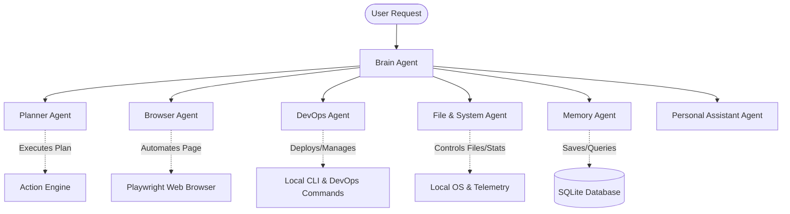

# JOJO - Personal AI Desktop Assistant (Production Release)

JOJO is a professional, portfolio-grade desktop personal assistant built with a **Clean Architecture** framework, a state-of-the-art **Multi-Agent Coordination Topology**, and a premium **PySide6 Desktop Application** interface. 

---

## 🏗️ Clean Architecture Diagram

The system strictly follows the dependency rule: dependencies point inwards. The core business rules (`Domain`) know nothing of use cases, UI controllers, or database schemas.

```mermaid
graph TD
    subgraph Interface Layer (Presentation)
        CLI[Command Line Chat]
        Desktop[PySide6 Desktop UI]
        Voice[Voice Assistant Worker]
    end

    subgraph Application Layer (Use Cases & Tools)
        Workflow[Multi-Agent Workflow Runner]
        Engine[Action Execution Engine]
        Registry[Tool Registry]
        SecMan[Security Manager & RBAC]
    end

    subgraph Infrastructure Layer (Adapters & External Services)
        Gemini[Gemini LLM & Embedding Service]
        SQLite[SQLite Storage Repo & Vector DB]
        Playwright[Playwright Web Browser Driver]
        SystemServ[Local System Service]
        VoiceServ[Google TTS & PyAudio Mic Service]
    end

    subgraph Domain Layer (Entities & Interfaces)
        Entities[Message, UserProfile, AuditLog Entities]
        Interfaces[Abstract Interfaces & Repositories]
    end

    CLI --> Workflow
    Desktop --> Workflow
    Voice --> Workflow
    Workflow --> Engine
    Engine --> Registry
    Registry --> Interfaces
    Interfaces -.-> Domain
    
    SQLite -- Implements --> Interfaces
    Gemini -- Implements --> Interfaces
    Playwright -- Implements --> Interfaces
    SystemServ -- Implements --> Interfaces
    VoiceServ -- Implements --> Interfaces
```

---

## 🤖 Multi-Agent Communication Topology

JOJO distributes work among dedicated, cooperative agent experts coordinated by the central **Brain Agent**:



---

## 🌟 Key Features

- **🎙️ Week 5 - Wake Word & continuous voice conversation**: Wake word detection ("JOJO") with Google Speech-to-Text command transcription and pyTTS text-to-speech feedback. Supports voice interruption.
- **💾 Week 6 - Local Memory & Vector Search**: Implements structured tables (preferences, command logs, and projects) plus a local SQLite-backed Vector Similarity database using cosine distance metrics.
- **📁 Week 7 - File & System Agent**: Performs safe file operations (create folder, rename, copy, move, and confirmation-guarded delete) alongside real-time OS telemetries (CPU load, RAM capacity, Disk space, and battery status).
- **📋 Week 8 - Task Planner & Executor Engine**: Takes multi-step tasks (e.g. *"search YouTube for tutorials and play the first video"*), generates a chronological step plan, and executes it via a state machine with automated error recovery.
- **🤝 Week 9 - Multi-Agent System**: Utilizes a Graph Workflow routing commands between specialized agents (Brain, Planner, Browser, DevOps, File, System, Memory).
- **🐳 Week 10 - DevOps Agent**: CLI integrations with Docker, Kubernetes, AWS (EC2/S3), Git, Terraform, Jenkins, and Ansible. Contains permission guards.
- **👁️ Week 11 - Vision & Screen Reader**: Captured screenshots are analyzed by the Gemini Vision LLM to debug UI issues or extract page text.
- **🗓️ Week 12 - Personal Assistant Routines**: Manages calendar events, to-do lists, email summaries, daily briefings, and automated daily routines.
- **🔒 Week 13 - Role-Based Access Control (RBAC)**: Defines strict user permission levels (`viewer`, `operator`, `admin`). Modifying settings, deleting files, or running Terraform mutations requires admin passcode (`admin123`) authorization.
- **💻 Week 14 - Premium PySide6 Desktop UI**: High-impact dark-themed Qt application displaying chat message lists, Live Status telemetry, Memory viewer logs, and an interactive Audit Logs table.
- **📦 Week 15 - Productionization**: Optimized database query speeds via SQLite indexes, added Docker Support, and configured GitHub Actions CI/CD automation.

---

## 🚀 Quick Start

### Prerequisites
- Python 3.12+
- PortAudio development headers (for microphone support):
  - Ubuntu/Debian: `sudo apt-get install portaudio19-dev libasound2-dev`
  - macOS: `brew install portaudio`

### Setup
1. Clone the repository and navigate to the project directory.
2. Initialize virtual environment and install packages:
   ```bash
   python -m venv .venv
   source .venv/bin/activate
   pip install -e .[dev]
   ```
3. Set your Google Gemini API key:
   ```bash
   cp .env.example .env
   # Edit .env and replace GEMINI_API_KEY with your Gemini API key
   ```
4. Install Playwright browser components:
   ```bash
   playwright install chromium
   ```

### Running the Application

- **CLI Mode**:
  ```bash
  python src/interface/cli/main.py
  ```
- **Voice Mode**:
  ```bash
  python src/interface/cli/voice_chat.py
  ```
- **Desktop Application (GUI)**:
  ```bash
  python src/interface/desktop/main.py
  ```

---

## 🐳 Docker Deployment

The application features full Docker containerization containing built-in headless Playwright browser support:

1. **Build and Run with Docker Compose**:
   ```bash
   docker compose run --rm ai-agent
   ```
2. **Persistence**:
   The SQLite database, system logs, and browser downloads are mounted locally under the `./data`, `./logs`, and `./downloads` folders respectively.

---

## 🧪 Testing and Code Quality

Execute the test suite and verify typing and code formatting:

```bash
# Run all unit, integration, and performance tests
pytest

# Code formatting checks
black --check src tests

# Linting checks
ruff check src tests

# Static type check
mypy src tests
```
